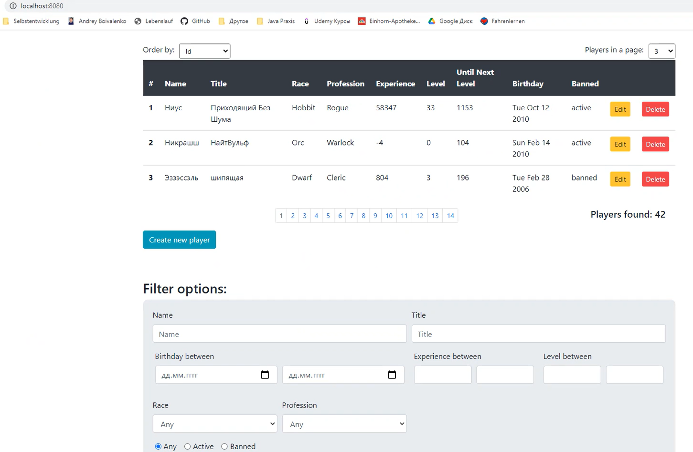

Maven, Spring, Spring Data JPA, MySQL, Tomcat, JUnit

# Spring MVC CRUD APPLICATION

<b>Description:</b>
There was a basis for a Spring MVC CRUD application (with a DB table "player"). 
The basis of the project included Spring configuration classes, UI and JUnit tests.

<b>I have implemented the following functions:</b>
1. Get a sorted list of players according to filters
2. Get the number of players that match certain filters
3. Create a new player and add it to the database
4. Get the player by identifier
5. Edit(Update) the characteristics of existing players
6. Delete the player by identifier
9. Implement the business logic of calculating the rating of the player
10. Validating incoming parameters on requests && correctly and dynamically display data 

<b>Technologies:</b>
1. Maven
2. Spring
3. Spring Data JPA
4. MySQL
5. Tomcat
6. JUnit

Screenshot from Frontend:
 
 

